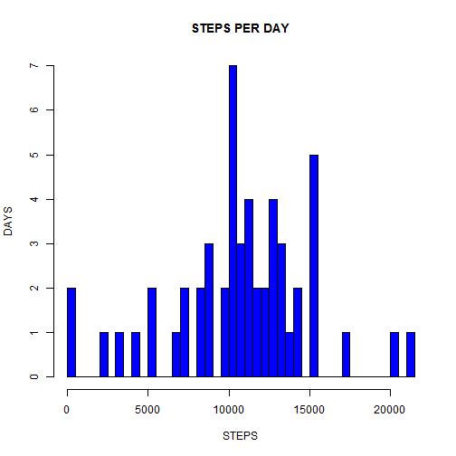
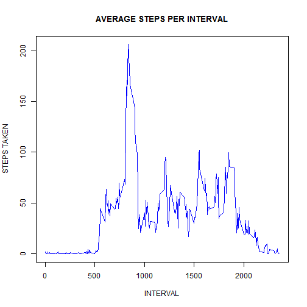
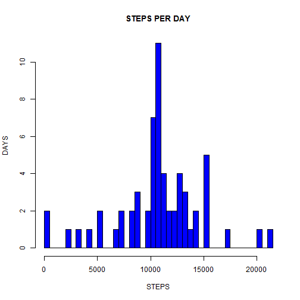
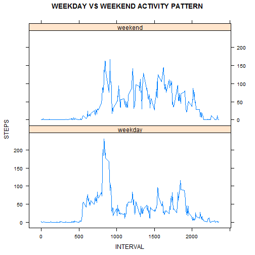

Reproducible Research Project 1
========================================================

#We need to load the data.


```r
data = read.csv("activity.csv", header = TRUE)
```


# What is mean total number of steps taken per day?
## Make a histogram of the total number of steps taken each day

We sum the steps for each day 

```r
stepsDay = aggregate(steps ~ date, data = data, FUN = sum)
```

So we have the total steps per day


```r
head(stepsDay)
```

```
##         date steps
## 1 2012-10-02   126
## 2 2012-10-03 11352
## 3 2012-10-04 12116
## 4 2012-10-05 13294
## 5 2012-10-06 15420
## 6 2012-10-07 11015
```


And we plot the data


```r
hist(stepsDay$steps, main = "STEPS PER DAY", breaks = nrow(stepsDay), xlab = "STEPS", 
    ylab = "DAYS", col = "blue")
```

 


## Calculate and report the mean and median total number of steps taken per day


```r
meanTotal <- mean(stepsDay[, 2])
medianTotal <- median(stepsDay[, 2])
```


### The mean of steps taken per day is 10766 and the median of steps taken per day is 10765.

# What is the average daily activity pattern?
## Make a time series plot of the 5-minute interval and the average number of steps taken, averaged across all days .

We get the mean of steps per interval

```r
stepsInterval <- aggregate(steps ~ interval, data = data, FUN = mean)
```


And we plot the data

```r
plot(stepsInterval, xlab = "INTERVAL", ylab = "STEPS TAKEN", type = "l", main = "AVERAGE STEPS PER INTERVAL", 
    col = "blue")
```

 


## Which 5-minute interval, on average across all the days in the dataset, contains the maximum number of steps?
We get the row with the highest number of steps

```r
max <- stepsInterval[which.max(stepsInterval$steps), ]
interval <- max[, 1]
```


### The interval with the maximum of steps is 835 

# Imputing missing values
## Calculate and report the total number of missing values in the dataset.

```r
missingVal <- sum(is.na(data))
```


## Devise a strategy for filling in all of the missing values in the dataset. The strategy does not need to be sophisticated. For example, you could use the mean/median for that day, or the mean for that 5-minute interval, etc.

We are going to use the mean value of the corresponding 5-minuite interval because if we count the NAs and group them by days


```r
# load the library
library(plyr)
count(subset(data, is.na(data)), vars = "date")
```

```
##         date freq
## 1 2012-10-01  288
## 2 2012-10-08  288
## 3 2012-11-01  288
## 4 2012-11-04  288
## 5 2012-11-09  288
## 6 2012-11-10  288
## 7 2012-11-14  288
## 8 2012-11-30  288
```


We realize that the days with missing data have 288 NAs per day, and that amount belong to all the intervals in a day.


```r
# load the library
nrow(stepsInterval)
```

```
## [1] 288
```


## Create a new dataset that is equal to the original dataset but with the missing data filled in.

We put our data in a new data set

```r
dataFull <- data
```


We know that the NAs are ordered by day and interval so we just assign the mean value of each interval to the NAs


```r
dataFull[is.na(dataFull)] <- intervalSteps[, 2]
```


## Make a histogram of the total number of steps taken each day and Calculate and report the mean and median total number of steps taken per day. Do these values differ from the estimates from the first part of the assignment? What is the impact of imputing missing data on the estimates of the total daily number of steps?

We sum the steps for each day using the same variable as before

```r
stepsDay = aggregate(steps ~ date, data = dataFull, FUN = sum)
```


And we plot the data


```r
hist(stepsDay$steps, main = "STEPS PER DAY", breaks = nrow(stepsDay), xlab = "STEPS", 
    ylab = "DAYS", col = "blue")
```

 

Then we calculate the mean an median


```r
meanTotal <- mean(stepsDay[, 2])
medianTotal <- median(stepsDay[, 2])
```


### The mean of steps taken per day  with no NAs is 10766 and the median of steps taken per day is 10766. The values did not differ because we use the means to fill the missing data, so  in this case there is no impact of inputing missing data

# Are there differences in activity patterns between weekdays and weekends?

## Create a new factor variable in the dataset with two levels - "weekday" and "weekend" indicating whether a given date is a weekday or weekend day.

We create a vector that contains the dates and give us a number for each day in the week, we use that because the weekdays() wont work in every language in the same way.


```r
dayNum <- as.POSIXlt(dataFull$date)$wday
```


We use a loop to replace the number of each day with the word "weekday" or "weekend", and then we convert the vector to a factor.


```r
for (i in 1:length(dayNum)) {
    if (dayNum[i] == 0 | dayNum[i] == 6) {
        dayNum[i] <- "weekend"
    } else {
        dayNum[i] <- "weekday"
    }
}
dayNum <- factor(dayNum)
```


Then we add the factor to our data set.

```r
dataFull$dayNum <- dayNum
str(dataFull)
```

```
## 'data.frame':	17568 obs. of  4 variables:
##  $ steps   : num  1.717 0.3396 0.1321 0.1509 0.0755 ...
##  $ date    : Factor w/ 61 levels "2012-10-01","2012-10-02",..: 1 1 1 1 1 1 1 1 1 1 ...
##  $ interval: int  0 5 10 15 20 25 30 35 40 45 ...
##  $ dayNum  : Factor w/ 2 levels "weekday","weekend": 1 1 1 1 1 1 1 1 1 1 ...
```


## Make a panel plot containing a time series plot  of the 5-minute interval and the average number of steps taken, averaged across all weekday days or weekend days. The plot should look something like the following, which was creating using simulated data:

First we get the mean oh steps per interval and weekdays or weekends and assign it to a new dataset

```r
stepsIntervalDay <- aggregate(steps ~ interval + dayNum, data = dataFull, FUN = mean)
```


And finally we plot the data

```r
require(lattice)
xyplot(steps ~ interval | stepsIntervalDay$dayNum, data = stepsIntervalDay, 
    type = "l", layout = c(1, 2), ylab = "STEPS", xlab = "INTERVAL", main = "WEEKDAY VS WEEKEND ACTIVITY PATTERN")
```

 

